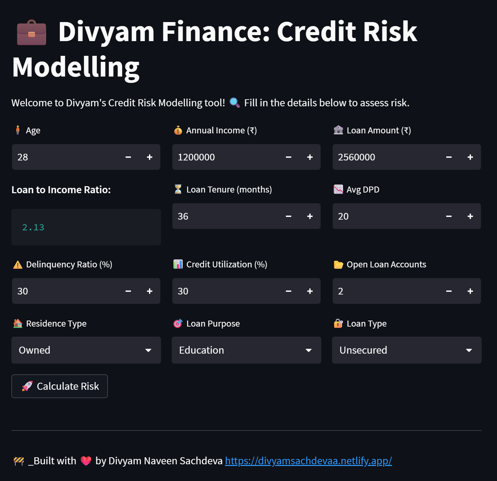
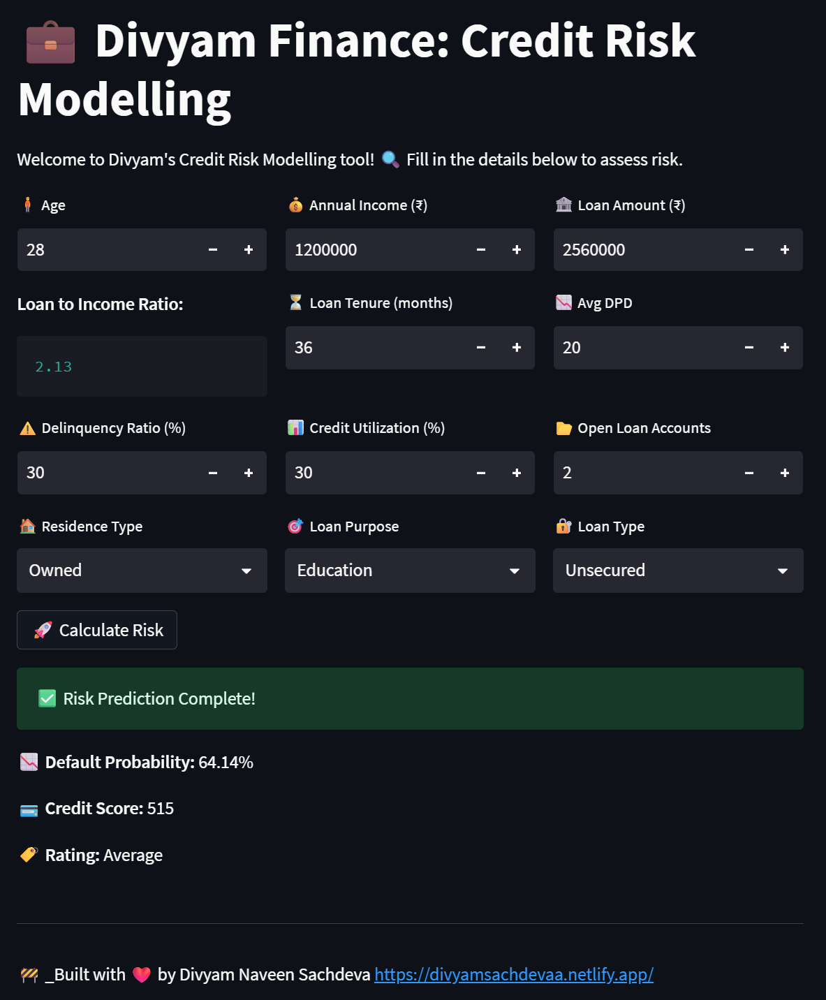

# 📊 Divyam Finance: Credit Risk Modelling

This is a credit risk prediction web app that I built while learning Machine Learning. The idea is simple — based on a person's financial profile, the model predicts how risky it is to lend them money.

I used **Python + Streamlit** to build the frontend and integrated a trained ML model (classification) in the backend. The model takes in various inputs like income, loan amount, credit utilization, delinquency ratio, and gives three things:
- **Default Probability**
- **Credit Score**
- **Rating (like Excellent, Good, Risky, etc.)**

---

### 🧠 What I Learned

This was more than just a coding project — it helped me understand:
- How real-world credit systems work (especially in NBFCs and banks)
- How to clean and preprocess messy financial data
- Feature engineering techniques like WOE, IV, and handling data leakage
- Model training, tuning (with Optuna), and evaluating using metrics like KS-statistic & Gini
- Building an end-to-end ML pipeline and deploying it with Streamlit

---

### ⚙️ Tech Stack

- Python
- Streamlit (for UI)
- scikit-learn
- pandas / numpy
- Optuna (for hyperparameter tuning)
- Matplotlib / Seaborn (EDA)
- Git (version control)

---

### 🚀 How to Run Locally

1. Clone the repo:
   ```bash
   git clone https://github.com/your-username/credit-risk-app.git
   cd credit-risk-app

    pip install -r requirements.txt
    streamlit run main.py


### 📷 UI Preview




### ✍️ Final Thoughts
I’ve named it Divyam Finance just for fun — to give it a personal touch. This project is still a work in progress and I plan to improve the model and maybe deploy it live someday.

If you’re learning ML like I am, I’d highly recommend the Codebasics ML course — that’s where this project comes from originally. I just customized it to make it mine.

Thanks for reading! 😊
Feel free to fork, play around, or reach out to me if you're doing something similar.